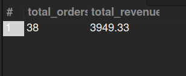

## 10. BOPIS Orders Revenue (Last Year)

## Business Problem:
### BOPIS (Buy Online, Pickup In Store) is a key retail strategy. Finance wants to know the revenue from BOPIS orders for the previous year.

## Fields to Retrieve:
1. TOTAL ORDERS
2. TOTAL REVENUE

## Solution:

```sql
SELECT count(oh.order_id) AS total_orders, sum(oh.grand_total) AS total_revenue
FROM ORDER_HEADER AS oh 
JOIN ORDER_ITEM_SHIP_GROUP AS oisg ON oisg.order_id = oh.order_id
WHERE oh.sales_channel_enum_id= 'WEB_SALES_CHANNEL' 
AND oh.status_id= 'ORDER_COMPLETED'
AND oh.order_type_id= 'SALES_ORDER'
AND oisg.shipment_method_type_id= 'STOREPICKUP'
AND year(oh.order_date)= year(curdate())-2;

```


## Query Cost: 1373.61