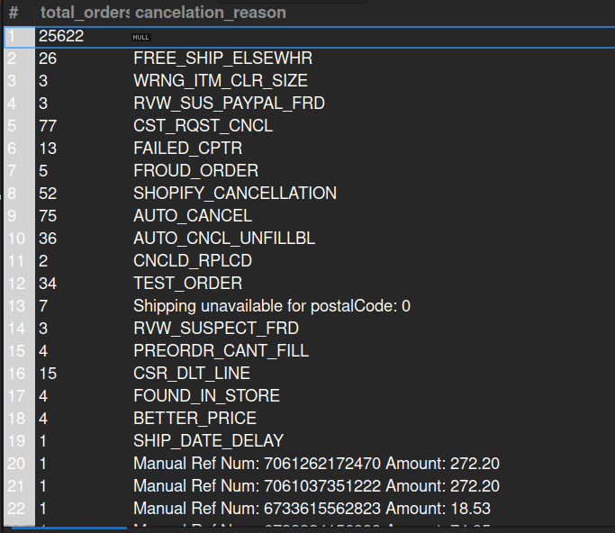

## 11. Canceled Orders (Last Month)

## Business Problem:
### The merchandising team needs to know how many orders were canceled in the previous month and their reasons.

## Fields to Retrieve:
1. TOTAL ORDERS
2. CANCELATION REASON

## Solution:-
```sql
SELECT count(oh.order_id) as total_orders, os.change_reason AS cancelation_reason
FROM ORDER_HEADER AS oh
JOIN ORDER_STATUS AS os ON os.order_id = oh.order_id
WHERE oh.status_id= 'ORDER_CANCELLED'
AND month(os.status_datetime)= month(curdate())-1
GROUP BY cancelation_reason;

```


## Query Cost: 90659.63