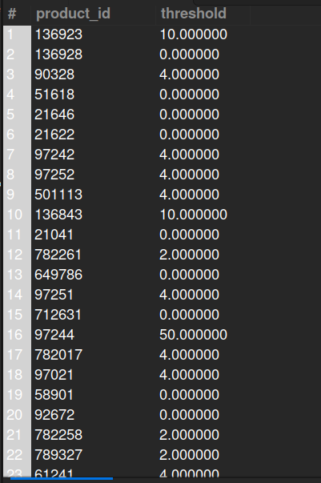
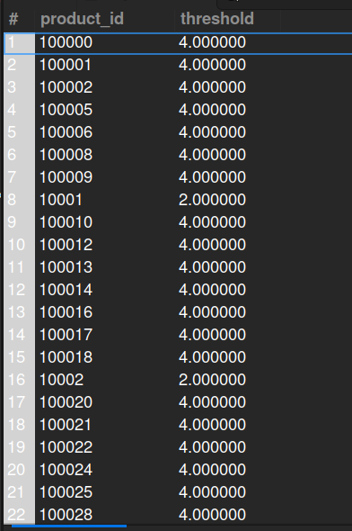

## 12. Product Threshold Value

## Business Problem 
### The retailer has set a threshold value for products that are sold online, in order to avoid over selling.

## Fields to Retrieve:
1. PRODUCT ID
2. THRESHOLD

## Solution:-
```sql
-- using order, 5776 records 
SELECT pf.product_id, pf.minimum_stock AS threshold
FROM PRODUCT_FACILITY AS pf
JOIN ORDER_ITEM AS oi ON oi.product_id= pf.product_id
JOIN ORDER_HEADER AS oh ON oh.order_id= oi.order_id
WHERE oh.sales_channel_enum_id= 'WEB_SALES_CHANNEL'
AND pf.minimum_stock is not null
GROUP BY pf.product_id;

-- CONFIGURATION is for onilne sales, used order entity
-- 2.57 lakh+ records
SELECT pf.product_id, pf.minimum_stock AS threshold
FROM PRODUCT_FACILITY AS pf
JOIN FACILITY AS f ON f.facility_id= pf.facility_id
WHERE f.facility_type_id= 'CONFIGURATION'
AND pf.minimum_stock is not null
GROUP BY pf.product_id;

```


## Query Cost: 316819.88



## Query Cost: 35719.65