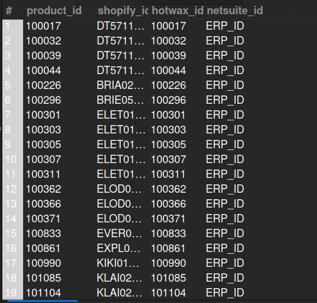

## 4. Product IDs Across Systems

## Business Problem:
### To sync an order or product across multiple systems (e.g., Shopify, HotWax, ERP/NetSuite), the OMS needs to know each system’s unique identifier for that product. This query retrieves the Shopify ID, HotWax ID, and ERP ID (NetSuite ID) for all products.

## Fields to Retrieve:
1. PRODUCT_ID (internal OMS ID)
2. SHOPIFY_ID
3. HOTWAX_ID
4. ERP_ID or NETSUITE_ID (depending on naming)

## Solution:- 
```sql
SELECT g1.product_id, g1.id_value  AS shopify_id, g1.product_id AS hotwax_id, g2.id_value AS netsuite_id
FROM GOOD_IDENTIFICATION AS g1 
JOIN GOOD_IDENTIFICATION AS g2 ON g2.product_id = g1.product_id
WHERE g1.good_identification_type_id IN ('SHOPIFY_PROD_ID', 'SHOPIFY_PROD_SKU') AND g2.good_identification_type_id IN ('ERP_ID');```


## Query Cost: 323050.92
