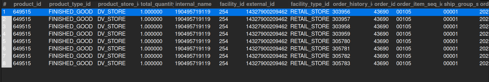

## 5. Completed Orders in August 2023

## Business Problem:
### After running similar reports for a previous month, you now need all completed orders in August 2023 for analysis.

## Fields to Retrieve:
1. PRODUCT_ID
2. PRODUCT_TYPE_ID
3. PRODUCT_STORE_ID
4. TOTAL_QUANTITY
5. INTERNAL_NAME
6. FACILITY_ID
7. EXTERNAL_ID
8. FACILITY_TYPE_ID
9. ORDER_HISTORY_ID
10. ORDER_ID
11. ORDER_ITEM_SEQ_ID
12. SHIP_GROUP_SEQ_ID

## Solution:-
```sql
SELECT p.product_id, p.product_type_id, oh.product_store_id, sum(oi.quantity) as total_quantity, p.internal_name, p.facility_id, oi.external_id, 
		f.facility_type_id, ohist.order_history_id, oi.order_id, oi.order_item_seq_id, oisg.ship_group_seq_id, oh.order_date
FROM ORDER_HEADER AS oh
JOIN ORDER_ITEM AS oi ON oi.order_id = oh.order_id
JOIN PRODUCT AS p ON p.product_id = oi.product_id
JOIN FACILITY AS f ON f.facility_id = p.facility_id
JOIN ORDER_HISTORY AS ohist ON ohist.order_id = oh.order_id
JOIN ORDER_ITEM_SHIP_GROUP AS oisg ON oisg.order_id = oi.order_id
WHERE oh.status_id = 'ORDER_COMPLETED' AND (oh.order_date BETWEEN '2023-08-01 00:00:00' AND '2023-08-31 11:59:59')
GROUP BY p.product_id, p.product_type_id, oh.product_store_id, p.facility_id, oh.external_id, f.facility_type_id, ohist.order_history_id,
		oh.order_id, oi.order_item_seq_id, oisg.ship_group_seq_id;


```



## Query Cost: 105574.63