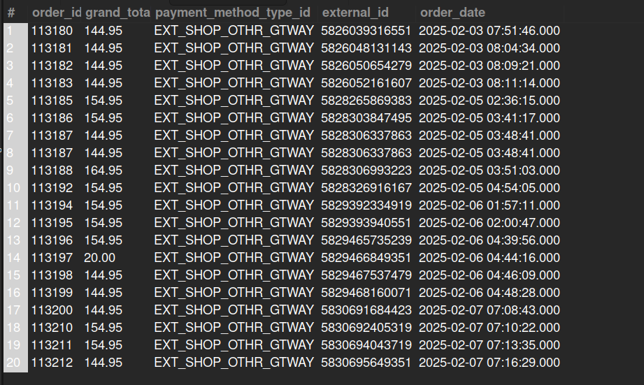

## 7. Newly Created Sales Orders and Payment Methods

## Business Problem:
### Finance teams need to see new orders and their payment methods for reconciliation and fraud checks.

## Fields to Retrieve:
1. ORDER_ID
2. TOTAL_AMOUNT
3. PAYMENT_METHOD
4. Shopify Order ID (if applicable)

## Solution:-
```sql
SELECT oh.order_id, oh.grand_total, opp.payment_method_type_id, oh.external_id, oh.order_date
FROM ORDER_HEADER AS oh
JOIN ORDER_PAYMENT_PREFERENCE AS opp ON opp.order_id = oh.order_id
WHERE oh.order_type_id = 'SALES_ORDER' AND (oh.order_date BETWEEN '2025-02-01 00:00:00' AND '2025-02-26 11:59:59');

```


## Query Cost: 9949.53