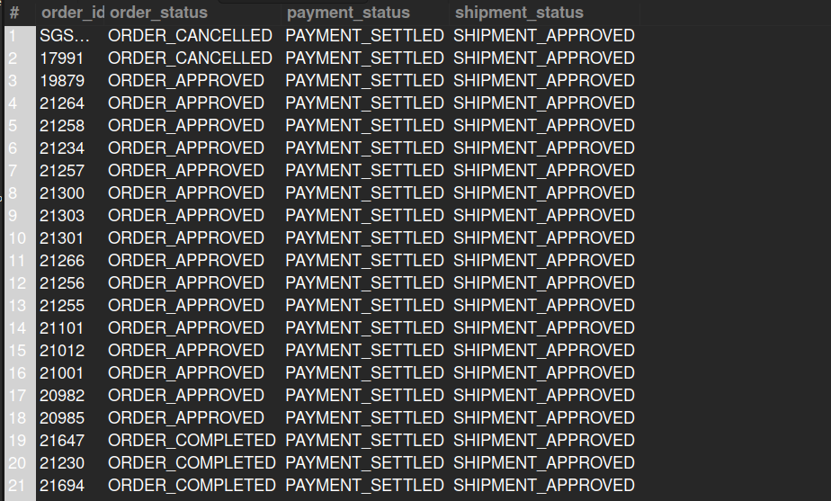

## 8. Payment Captured but Not Shipped

## Business Problem:
### Finance teams want to ensure revenue is recognized properly. If payment is captured but no shipment has occurred, it warrants further review.

## Fields to Retrieve:
1. ORDER_ID
2. ORDER_STATUS
3. PAYMENT_STATUS
4. SHIPMENT_STATUS

## Solution:-
```sql
SELECT DISTINCT
oh.order_id, oh.status_id AS order_status, opp.status_id AS payment_status, s.status_id AS shipment_status
FROM ORDER_HEADER AS oh
JOIN ORDER_PAYMENT_PREFERENCE AS opp ON opp.order_id = oh.order_id
JOIN ORDER_SHIPMENT AS os ON os.order_id = oh.order_id
JOIN SHIPMENT AS s ON s.shipment_id = os.shipment_id										
WHERE opp.status_id = 'PAYMENT_SETTLED' AND s.status_id <> 'SHIPMENT_SHIPPED'; 
```

