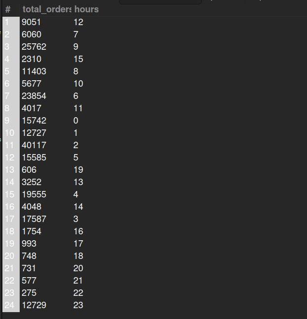

## 9. Orders Completed Hourly
## Business Problem:
### Operations teams may want to see how orders complete across the day to schedule staffing.

## Fields to Retrieve:

1. TOTAL ORDERS
2. HOUR

## Solution:-
```sql
SELECT COUNT(oh.order_id) AS total_orders, HOUR(os.status_datetime) as hours
FROM ORDER_HEADER AS oh
JOIN ORDER_STATUS AS os ON os.order_id= oh.order_id
WHERE oh.status_id= 'ORDER_COMPLETED' 
GROUP BY hours;

```



## Query Cost: 106752.88