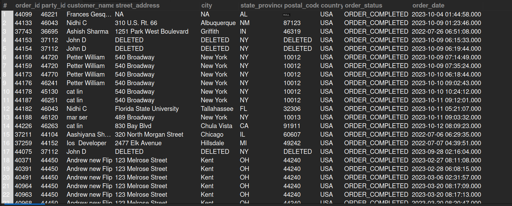

## 5.1. Shipping Addresses for October 2023 Orders
## Business Problem:
### Customer Service might need to verify addresses for orders placed or completed in October 2023. This helps ensure shipments are delivered correctly and prevents address-related issues.

## Fields to Retrieve:
1. ORDER_ID
2. PARTY_ID (Customer ID)
3. CUSTOMER_NAME (or FIRST_NAME / LAST_NAME)
4. STREET_ADDRESS
5. CITY
6. STATE_PROVINCE
7. POSTAL_CODE
8. COUNTRY_CODE
9. ORDER_STATUS
10. ORDER_DATE

## Solution:
```sql
SELECT DISTINCT oh.order_id, orole.party_id, concat(per.first_name, " ", per.last_name) AS customer_name, pa.address1 AS street_address, pa.city,  
		pa.state_province_geo_id AS state_province, pa.postal_code, pa.country_geo_id AS country, oh.status_id AS order_status, oh.order_date
FROM ORDER_HEADER AS oh
JOIN ORDER_ROLE AS orole ON orole.order_id= oh.order_id AND orole.role_type_id= 'SHIP_TO_CUSTOMER'
JOIN ORDER_STATUS AS os ON os.order_id= oh.order_id
JOIN PERSON AS per ON per.party_id= orole.party_id 
JOIN ORDER_CONTACT_MECH AS ocm ON ocm.order_id= oh.order_id AND ocm.contact_mech_purpose_type_id= 'SHIPPING_LOCATION'
JOIN POSTAL_ADDRESS AS pa ON pa.contact_mech_id= ocm.contact_mech_id
WHERE oh.status_id IN ('ORDER_COMPLETED', 'ORDER_CREATED')
AND os.status_datetime BETWEEN '2023-10-01 00:00:00' AND '2023-10-31 23:59:59';

```


## Query Cost: 217596.47