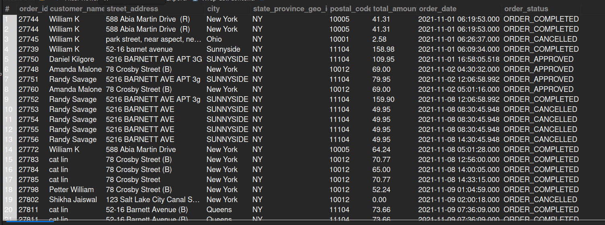

## 5.2. Orders from New York

## Business Problem:
### Companies often want region-specific analysis to plan local marketing, staffing, or promotions in certain areas—here, specifically, New York.

## Fields to Retrieve:
1. ORDER_ID
2. CUSTOMER_NAME
3. STREET_ADDRESS (or shipping address detail)
4. CITY
5. STATE_PROVINCE
6. POSTAL_CODE
7. TOTAL_AMOUNT
8. ORDER_DATE
9. ORDER_STATUS

## Solution:-
```sql

SELECT oh.order_id, concat(per.first_name, " ", per.last_name) AS customer_name, pa.address1 AS street_address, pa.city, pa.state_province_geo_id,
		pa.postal_code, oh.grand_total AS total_amount, oh.order_date, oh.status_id AS order_status
FROM ORDER_HEADER AS oh 
JOIN ORDER_ROLE AS orole ON orole.order_id= oh.order_id AND orole.role_type_id= 'SHIP_TO_CUSTOMER'
JOIN PERSON AS per ON per.party_id= orole.party_id
JOIN ORDER_CONTACT_MECH AS ocm ON ocm.order_id= oh.order_id AND ocm.contact_mech_purpose_type_id= 'SHIPPING_LOCATION'
JOIN POSTAL_ADDRESS AS pa ON pa.contact_mech_id= ocm.contact_mech_id AND pa.state_province_geo_id= 'NY'
WHERE oh.order_type_id= 'SALES_ORDER';
```


## Query Cost: 38650.25