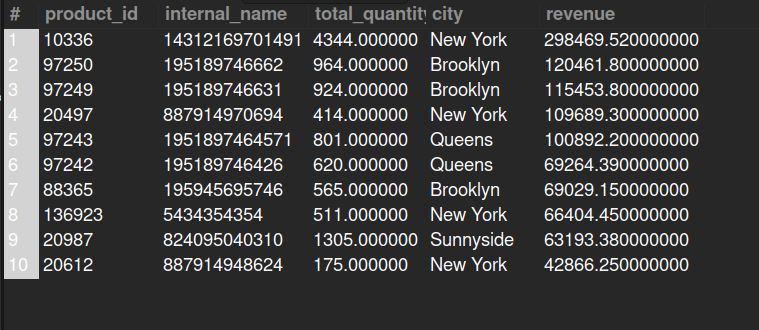

## 5.3. Top-Selling Product in New York

## Business Problem:
### Merchandising teams need to identify the best-selling product(s) in a specific region (New York) for targeted restocking or promotions.

## Fields to Retrieve:
1. PRODUCT_ID
2. INTERNAL_NAME
3. TOTAL_QUANTITY_SOLD
4. CITY / STATE (within New York region)
5. REVENUE (optionally, total sales amount)

## Solution:-
```sql
SELECT p.product_id, p.internal_name, sum(oi.quantity) AS total_quantity, pa.city, sum(oi.quantity * oi.unit_price) AS revenue
FROM PRODUCT AS p
JOIN ORDER_ITEM AS oi ON oi.product_id= p.product_id
JOIN ORDER_HEADER AS oh ON oh.order_id= oi.order_id
JOIN ORDER_CONTACT_MECH AS ocm ON ocm.order_id= oh.order_id AND oh.order_type_id= 'SALES_ORDER'
JOIN POSTAL_ADDRESS AS pa ON pa.contact_mech_id= ocm.contact_mech_id AND pa.state_province_geo_id= 'NY'
GROUP BY p.product_id
ORDER BY revenue DESC
LIMIT 10;

```


## Query Cost: 98127.79