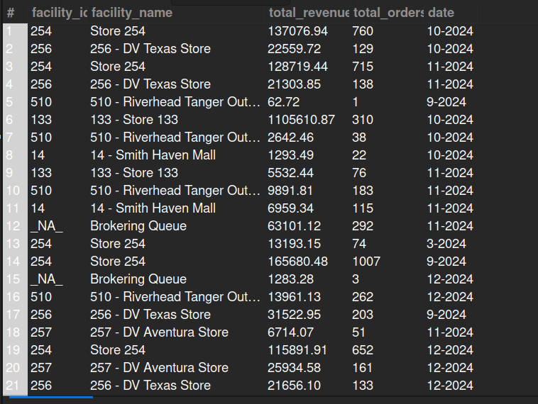

## 7.3. Store-Specific (Facility-Wise) Revenue

## Business Problem:
### Different physical or online stores (facilities) may have varying levels of performance. The business wants to compare revenue across facilities for sales planning and budgeting.

## Fields to Retrieve:
1. FACILITY_ID
2. FACILITY_NAME
3. TOTAL_ORDERS
4. TOTAL_REVENUE
5. DATE_RANGE

## Solution:-
```sqlSELECT f.facility_id, f.facility_name, sum(oh.grand_total) AS total_revenue, count(oh.order_id) AS total_orders, concat(month(oh.order_date), '-', year(oh.order_date)) AS date
FROM ORDER_HEADER AS oh
JOIN FACILITY AS f ON f.facility_id= oh.origin_facility_id 
WHERE oh.status_id= 'ORDER_COMPLETED' 
AND oh.sales_channel_enum_id IN ('WEB_SALES_CHANNEL', 'POS_SALES_CHANNEL')
GROUP BY f.facility_id, f.facility_name, date, oh.sales_channel_enum_id;

```


## Query Cost: 16371.18