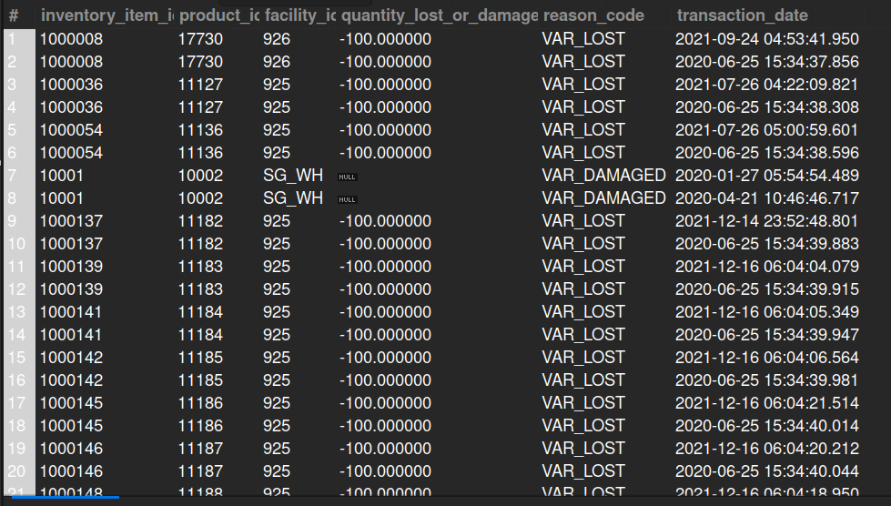

## 8.1. Lost and Damaged Inventory
## Business Problem:
### Warehouse managers need to track “shrinkage” such as lost or damaged inventory to reconcile physical vs. system counts.

## Fields to Retrieve:
1. INVENTORY_ITEM_ID
2. PRODUCT_ID
3. FACILITY_ID
4. QUANTITY_LOST_OR_DAMAGED
5. REASON_CODE (Lost, Damaged, Expired, etc.)
6. TRANSACTION_DATE

## Solution:-
```sql
SELECT i.inventory_item_id, i.product_id, i.facility_id, iiv.quantity_on_hand_var AS quantity_lost_or_damaged, iiv.variance_reason_id AS reason_code, 
		iid.effective_date AS transaction_date
FROM INVENTORY_ITEM AS i
JOIN INVENTORY_ITEM_VARIANCE AS iiv ON iiv.inventory_item_id= i.inventory_item_id AND iiv.variance_reason_id IN ('VAR_DAMAGED', 'VAR_LOST', 'VAR_STOLEN') 
JOIN INVENTORY_ITEM_DETAIL AS iid ON iid.inventory_item_id= i.inventory_item_id;

```



## Query Cost: 1065782.85