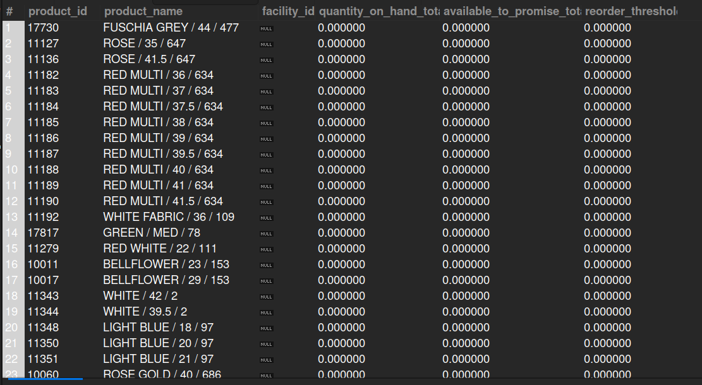

## 8.2. Low Stock or Out of Stock Items Report
## Business Problem:
### Avoiding out-of-stock situations is critical. This report flags items that have fallen below a certain reorder threshold or have zero available stock.

## Fields to Retrieve:
1. PRODUCT_ID
2. PRODUCT_NAME
3. FACILITY_ID
4. QOH (Quantity on Hand)
5. ATP (Available to Promise)
6. REORDER_THRESHOLD
7. DATE_CHECKED

## Solution:
```sql
SELECT  p.product_id, p.product_name, p.facility_id, i.quantity_on_hand_total, i.available_to_promise_total, pf.minimum_stock AS reorder_threshold
FROM PRODUCT AS p
JOIN INVENTORY_ITEM AS i ON i.product_id= p.product_id
JOIN PRODUCT_FACILITY AS pf ON pf.product_id= p.product_id AND pf.facility_id= i.facility_id
WHERE i.quantity_on_hand_total<= pf.minimum_stock OR i.quantity_on_hand_total=0;

```


## Query Cost: 3967815.10