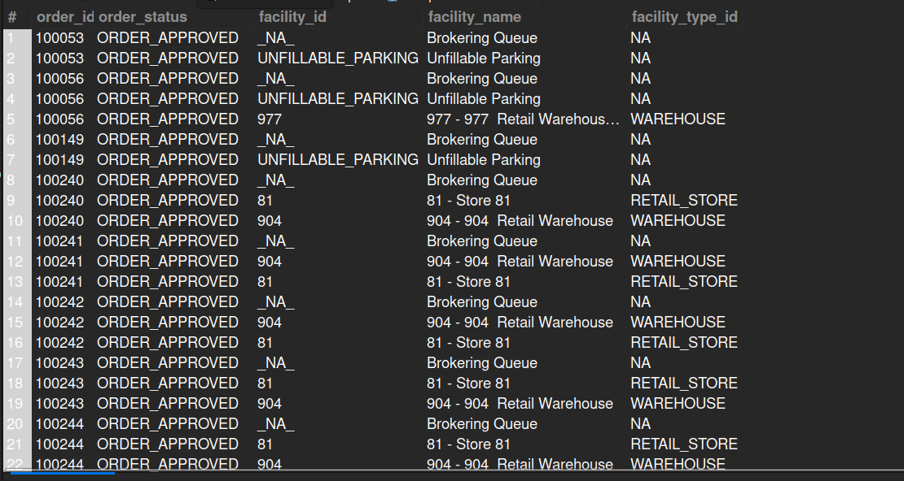

## 8.4. Retrieve the Current Facility (Physical or Virtual) of Open Orders
## Business Problem:
### The business wants to know where open orders are currently assigned, whether in a physical store or a virtual facility (e.g., a distribution center or online fulfillment location).

## Fields to Retrieve:
1. ORDER_ID
2. ORDER_STATUS
3. FACILITY_ID
4. FACILITY_NAME
5. FACILITY_TYPE_ID

## Solution:-
```sql
SELECT oh.order_id, oh.status_id AS order_status, f.facility_id, f.facility_name, f.facility_type_id
FROM ORDER_HEADER AS oh
JOIN ORDER_ITEM_SHIP_GROUP AS oisg ON oisg.order_id= oh.order_id 
JOIN FACILITY AS f ON f.facility_id= oisg.facility_id
WHERE oh.status_id !='ORDER_COMPLETED' AND oh.status_id !='ORDER_CANCELLED';

```



## Query Cost: 11651
