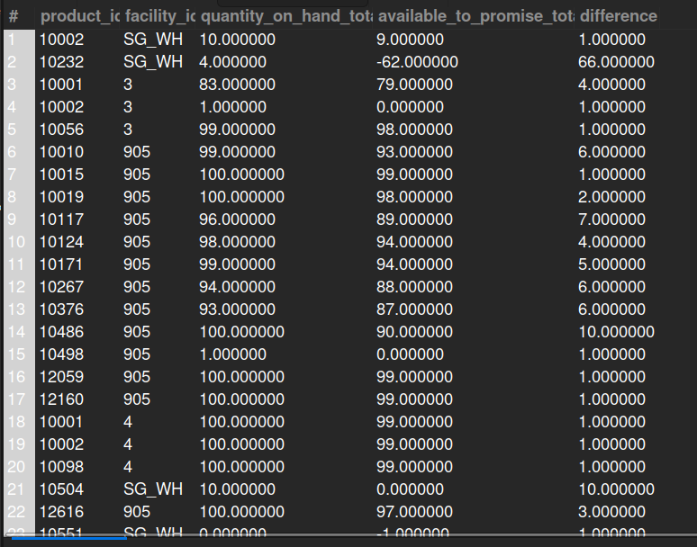

## 8. Items Where QOH and ATP Differ
## Business Problem:
### Sometimes the Quantity on Hand (QOH) doesn’t match the Available to Promise (ATP) due to pending orders, reservations, or data discrepancies. This needs review for accurate fulfillment planning.

## Fields to Retrieve:

1. PRODUCT_ID
2. FACILITY_ID
3. QOH (Quantity on Hand)
4. ATP (Available to Promise)
5. DIFFERENCE (QOH - ATP)

## Solution:-
```sql
SELECT i.product_id, i.facility_id, i.quantity_on_hand_total, i.available_to_promise_total, (i.quantity_on_hand_total - i.available_to_promise_total) AS difference
FROM INVENTORY_ITEM AS i 
WHERE i.quantity_on_hand_total <> i.available_to_promise_total;

```


## Query Cost: 214278.82