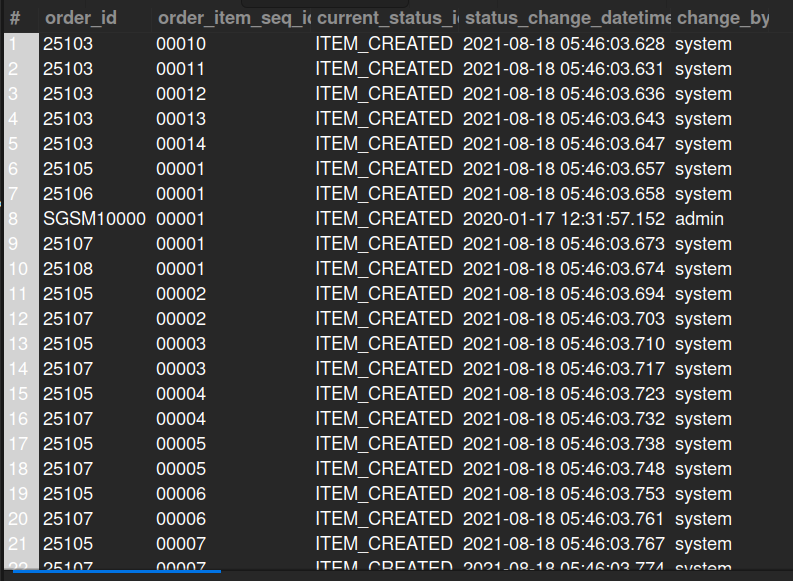

## 8.5. Order Item Current Status Changed Date-Time

## Business Problem:
### Operations teams need to audit when an order item’s status (e.g., from “Pending” to “Shipped”) was last changed, for shipment tracking or dispute resolution.

## Fields to Retrieve:
1. ORDER_ID
2. ORDER_ITEM_SEQ_ID
3. CURRENT_STATUS_ID
4. STATUS_CHANGE_DATETIME
5. CHANGED_BY

## Solution:-
```sql
SELECT os.order_id, os.order_item_seq_id, os.status_id AS current_status_id, os.status_datetime AS status_change_datetime, os.status_user_login AS change_by
FROM ORDER_STATUS AS os 
WHERE os.order_item_seq_id IS NOT NULL;
```



## Query Cost: 68220.77