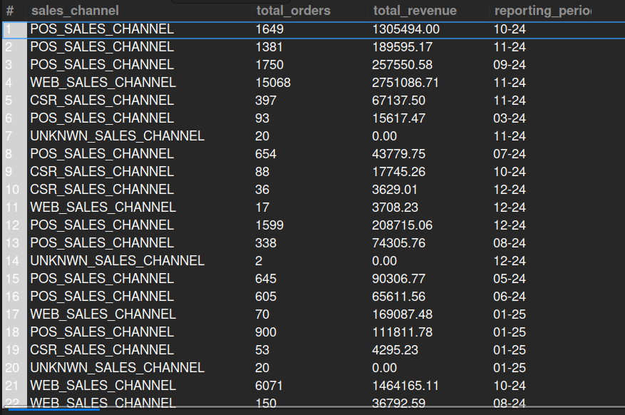

## 8.6. Total Orders by Sales Channel
## Business Problem:
### Marketing and sales teams want to see how many orders come from each channel (e.g., web, mobile app, in-store POS, marketplace) to allocate resources effectively.

## Fields to Retrieve:
1. SALES_CHANNEL
2. TOTAL_ORDERS
3. TOTAL_REVENUE
4. REPORTING_PERIOD

## Solution:-
```sql
SELECT oh.sales_channel_enum_id AS sales_channel, count(oh.order_id) AS total_orders, sum(oh.grand_total) AS total_revenue, 
		date_format(oh.order_date, '%m-%y') AS reporting_period
FROM ORDER_HEADER AS oh
WHERE oh.sales_channel_enum_id IS NOT NULL
GROUP BY sales_channel, reporting_period;

```




## Query Cost: 8450.55