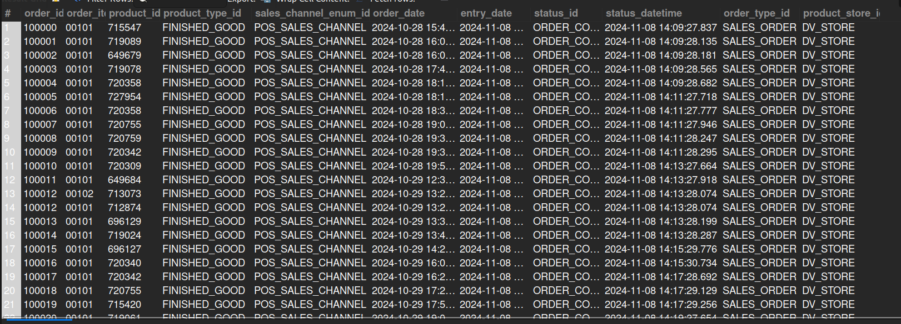

## 1. Completed Sales Orders (Physical Items)

## Business Problem:
### Merchants need to track only physical items (requiring shipping and fulfillment) for logistics and shipping-cost analysis.

## Fields to Retrieve:
1. ORDER_ID
2. ORDER_ITEM_SEQ_ID
3. PRODUCT_ID
4. PRODUCT_TYPE_ID
5. SALES_CHANNEL_ENUM_ID
6. ORDER_DATE
7. ENTRY_DATE
8. STATUS_ID
9. STATUS_DATETIME
10. ORDER_TYPE_ID
11. PRODUCT_STORE_ID

## Solution:-
```sql
SELECT oh.order_id, oi.order_item_seq_id, p.product_id, p.product_type_id, oh.sales_channel_enum_id, oh.order_date, oh.entry_date, os.status_id, 
		os.status_datetime, oh.order_type_id, oh.product_store_id
FROM ORDER_HEADER AS oh
JOIN ORDER_ITEM AS oi ON oi.order_id= oh.order_id
JOIN ORDER_STATUS AS os ON os.order_id= oh.order_id AND os.status_id= 'ORDER_COMPLETED'
JOIN PRODUCT AS p ON p.product_id= oi.product_id
JOIN PRODUCT_TYPE AS pt ON pt.product_type_id= p.product_type_id AND pt.is_physical='Y' 
WHERE oh.order_type_id='SALES_ORDER';

```



## Query Cost: 178342.65