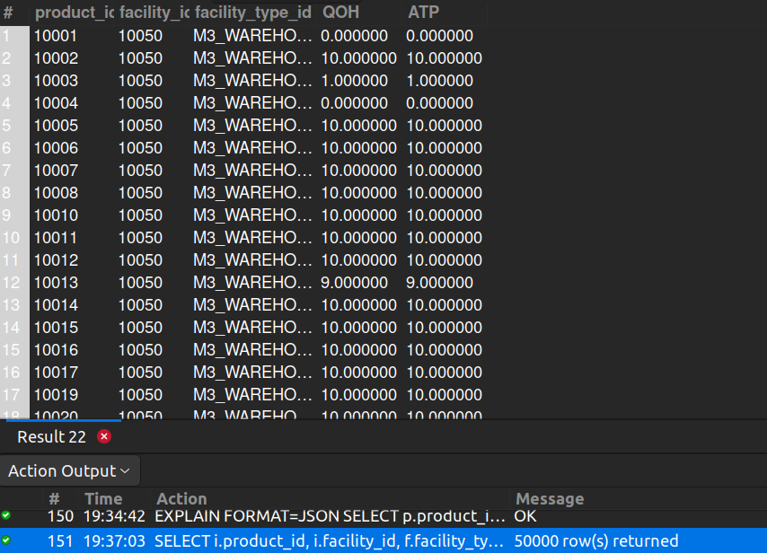

## 10. Total Items in Various Virtual Facilities

## Business Problem:
### Virtual facilities (such as online-only fulfillment centers) handle a different inventory process. The company wants a snapshot of total stock across these virtual locations.

## Fields to Retrieve:
1. PRODUCT_ID
2. FACILITY_ID
3. FACILITY_TYPE_ID
4. QOH (Quantity on Hand)
5. ATP (Available to Promise)

## Solution:-
```sql
SELECT i.product_id, i.facility_id, f.facility_type_id, i.quantity_on_hand_total AS QOH, i.available_to_promise_total AS ATP
FROM INVENTORY_ITEM AS i
JOIN FACILITY AS f ON f.facility_id= i.facility_id AND f.facility_type_id <> 'VIRTUAL_FACILITY';

```


## Query Cost: 2147341.56