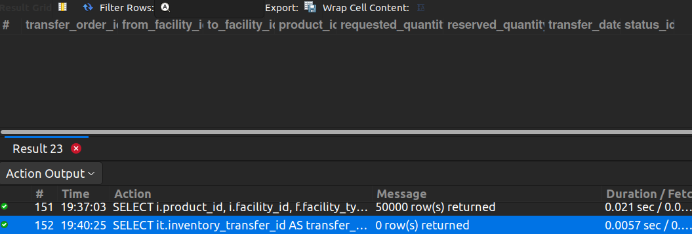

## 11. Transfer Orders Without Inventory Reservation

## Business Problem:
### When transferring stock between facilities, the system should reserve inventory. If it isn’t reserved, the transfer may fail or oversell.

## Fields to Retrieve:
1. TRANSFER_ORDER_ID
2. FROM_FACILITY_ID
3. TO_FACILITY_ID
4. PRODUCT_ID
5. REQUESTED_QUANTITY
6. RESERVED_QUANTITY
7. TRANSFER_DATE
8. STATUS

## Solution:-
```sql
SELECT it.inventory_transfer_id AS transfer_order_id, it.facility_id AS from_facility_id, it.facility_id_to AS to_facility_id, it.product_id, 
		it.quantity AS requested_quantity, oisgir.quantity AS reserved_quantity, it.send_date AS transfer_date, it.status_id
FROM INVENTORY_TRANSFER AS it
JOIN ORDER_ITEM_SHIP_GRP_INV_RES AS oisgir ON oisgir.inventory_item_id= it.inventory_item_id;

```

