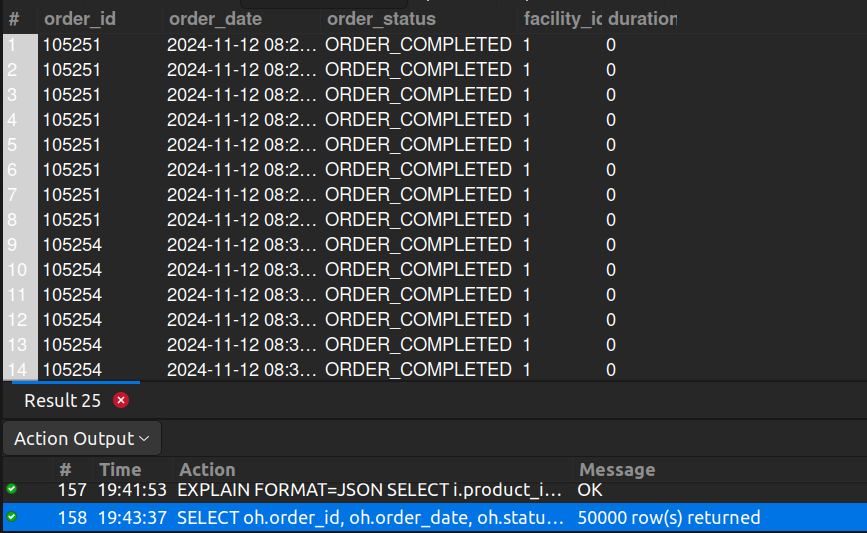

## 12. Orders Without Picklist

## Business Problem:
### A picklist is necessary for warehouse staff to gather items. Orders missing a picklist might be delayed and need attention.

## Fields to Retrieve:
1. ORDER_ID
2. ORDER_DATE
3. ORDER_STATUS
4. FACILITY_ID
5. DURATION (How long has the order been assigned at the facility)

## Solution:-
```sql
SELECT oh.order_id, oh.order_date, oh.status_id AS order_status, oisg.facility_id, 
		datediff(date(os.status_datetime), date(oh.entry_date)) as duration
FROM ORDER_HEADER AS oh
JOIN ORDER_ITEM_SHIP_GROUP AS oisg ON oisg.order_id= oh.order_id
JOIN ORDER_STATUS AS os ON os.order_id= oh.order_id
JOIN PICKLIST AS pl ON pl.facility_id= oisg.facility_id
WHERE pl.status_id IS NULL;
```

