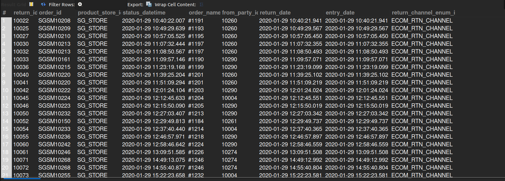

## 2. Completed Return Items

## Business Problem:
### Customer service and finance often need insights into returned items to manage refunds, replacements, and inventory restocking.

## Fields to Retrieve:
1. RETURN_ID
2. ORDER_ID
3. PRODUCT_STORE_ID
4. STATUS_DATETIME
5. ORDER_NAME
6. FROM_PARTY_ID
7. RETURN_DATE
8. ENTRY_DATE
9. RETURN_CHANNEL_ENUM_ID

## Solution:-
```sql
SELECT rh.return_id, oh.order_id, oh.product_store_id, rs.status_datetime, oh.order_name, rh.from_party_id,
		rh.return_date, rh.entry_date, rh.return_channel_enum_id
FROM RETURN_HEADER AS rh
JOIN RETURN_ITEM AS ri ON ri.return_id= rh.return_id AND ri.status_id= 'RETURN_COMPLETED'
JOIN RETURN_STATUS AS rs ON rs.return_id= rh.return_id 
JOIN ORDER_HEADER AS oh ON oh.order_id= ri.order_id ;
```



## Query Cost: 8209.97