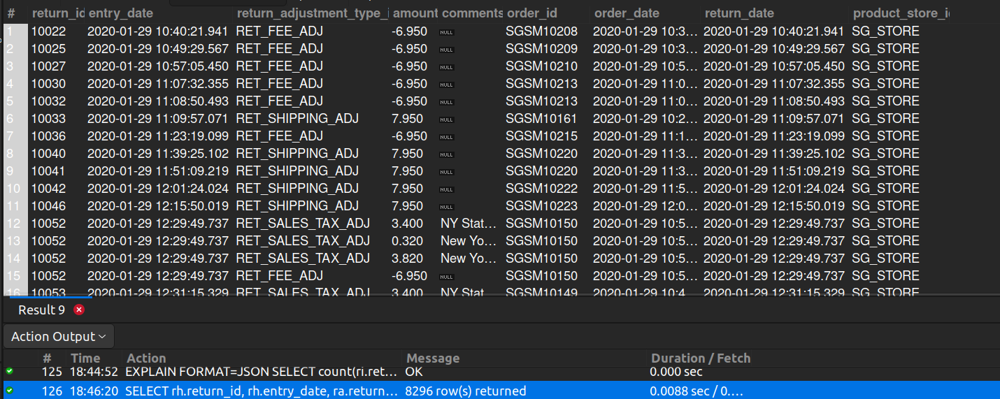

## 5. Detailed Return Information

## Business Problem:
### Certain teams need granular return data (reason, date, refund amount) for analyzing return rates, identifying recurring issues, or updating policies.

## Fields to Retrieve:
1. RETURN_ID
2. ENTRY_DATE
3. RETURN_ADJUSTMENT_TYPE_ID (refund type, store credit, etc.)
4. AMOUNT
5. COMMENTS
6. ORDER_ID
7. ORDER_DATE
8. RETURN_DATE
9. PRODUCT_STORE_ID

## Solution:-
```sql
SELECT rh.return_id, rh.entry_date, ra.return_adjustment_type_id, ra.amount, ra.comments,
		oh.order_id, oh.order_date, rh.return_date, oh.product_store_id
FROM RETURN_HEADER AS rh
JOIN RETURN_ADJUSTMENT AS ra ON ra.return_id= rh.return_id
JOIN RETURN_ITEM AS ri ON ri.return_id= rh.return_id
JOIN ORDER_HEADER AS oh ON oh.order_id= ri.order_id;

```


## Query Cost: 6353.77