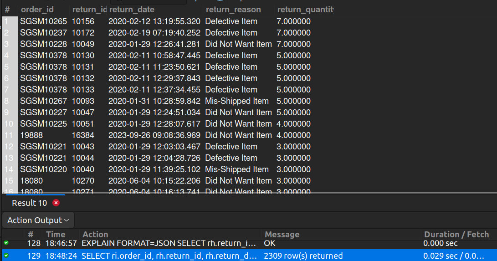

## 6. Orders with Multiple Returns

## Business Problem:
### Analyzing orders with multiple returns can identify potential fraud, chronic issues with certain items, or inconsistent shipping processes.

## Fields to Retrieve:
1. ORDER_ID
2. RETURN_ID
3. RETURN_DATE
4. RETURN_REASON
5. RETURN_QUANTITY

## Solution:-
```sql
SELECT ri.order_id, rh.return_id, rh.return_date, rr.description AS return_reason, ri.return_quantity 
FROM RETURN_HEADER AS rh
JOIN RETURN_ITEM AS ri ON ri.return_id= rh.return_id
JOIN RETURN_REASON AS rr ON rr.return_reason_id= ri.return_reason_id
WHERE ri.order_id IN(
	SELECT order_id
    FROM return_item
    GROUP BY order_id
    HAVING count(return_id)>1
    )
ORDER BY ri.return_quantity DESC;

```


## Query Cost: 7629.25