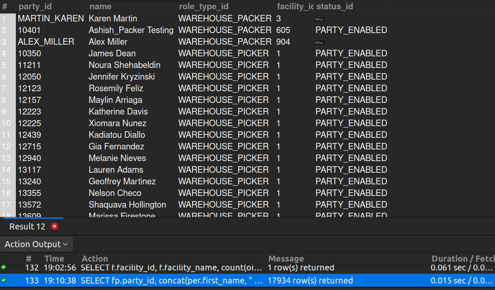

## 8. List of Warehouse Pickers

## Business Problem:
### Warehouse managers need a list of employees responsible for picking and packing orders to manage shifts, productivity, and training needs.

## Fields to Retrieve:
1. PARTY_ID (or Employee ID)
2. NAME (First/Last)
3. ROLE_TYPE_ID (e.g., “WAREHOUSE_PICKER”)
4. FACILITY_ID (assigned warehouse)
5. STATUS (active or inactive employee)

## Solution:-
```sql
SELECT fp.party_id, concat(per.first_name, " ", per.last_name) AS name, fp.role_type_id, fp.facility_id, p.status_id
FROM FACILITY_PARTY AS fp
JOIN PARTY AS p ON p.party_id= fp.party_id
JOIN PERSON AS per ON per.party_id= p.party_id
WHERE fp.role_type_id IN ('WAREHOUSE_PACKER', 'WAREHOUSE_PICKER');

```



## Query Cost: 12027.55