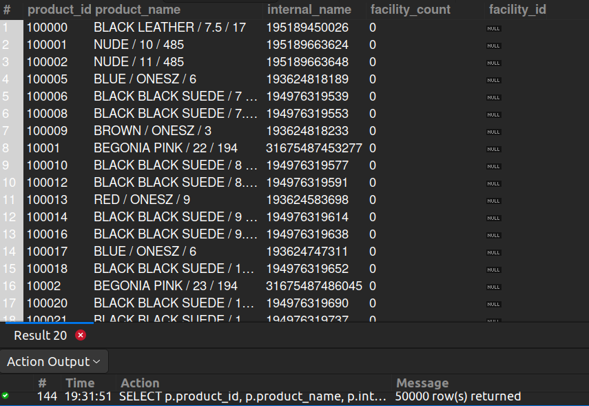

## 9. Total Facilities That Sell the Product

## Business Problem:
### Retailers want to see how many (and which) facilities (stores, warehouses, virtual sites) currently offer a product for sale.

## Fields to Retrieve:
1. PRODUCT_ID
2. PRODUCT_NAME (or INTERNAL_NAME)
3. FACILITY_COUNT (number of facilities selling the product)
4. (Optionally) a list of FACILITY_IDs if more detail is needed

## Solution:-
```sql
-- by product_id 50k+ records are fetched but in product_facility only one record facility_id is available
SELECT p.product_id, p.product_name, p.internal_name, count(p.facility_id) AS facility_count, p.facility_id
FROM PRODUCT p
JOIN PRODUCT_FACILITY AS pf ON pf.facility_id= p.facility_id
GROUP BY p.product_id, p.product_name, p.facility_id;


SELECT p.product_id, p.product_name, p.internal_name, count(p.facility_id) AS facility_count, p.facility_id
FROM PRODUCT p
JOIN PRODUCT_FACILITY AS pf ON pf.product_id= p.product_id
GROUP BY p.product_id, p.product_name, p.facility_id;

```

## Query Cost: 756410803.09


## Query Cost: 1252891.44
